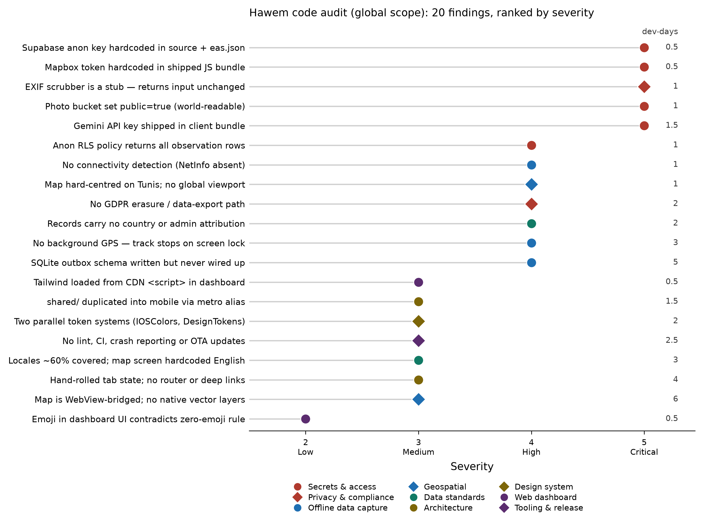

# Hawem (حايم) — Technical Review & Modernisation Plan

Audit date: 2026-09-25 · Reviewed at commit `fac838b` · Scope: `apps/mobile`, `apps/dashboard`, `packages/shared`, `supabase/`

**Product scope for this plan: worldwide.** Hawem is no longer a Tunisia-specific deployment. Every recommendation below assumes an unbounded, globally distributed volunteer base. Two consequences run through the whole document:

- **Offline basemap tiles are out of scope.** Downloadable map regions, region pickers, and offline tile packs are deliberately excluded. The map requires connectivity.
- **Arabic and RTL are deprioritised.** They are not scheduled work. The only carry-over is a styling convention (§6.4) that costs nothing now and avoids a rewrite if Arabic returns later.

**Offline *data capture* remains in scope and is the highest-value work in this plan.** That distinction is deliberate: a volunteer in a canyon, a basement car park, or a rural area with no signal must not lose a survey. Losing the map is an inconvenience; losing an hour of observations is a lost field session. See §4 and Sprint 2.

Every recommendation is a single named choice. Where alternatives exist, the rationale for the pick is stated and the alternatives are not carried forward.

---

## 1. Executive summary

Hawem has an unusually strong specification layer. `BRIEF.md`, `product.md`, `engineering.md`, `ui.md` and the four `docs/*.md` files describe a citizen-science observatory with real scientific ambition — Darwin Core exports, SECR/Distance-sampling-ready fields, a privacy-preserving location split, an offline-first outbox, and an AI vision tier.

**The central finding of this audit is a gap between the specification and the running code.** Several load-bearing systems exist as well-written type definitions and SQL schemas that nothing imports. The app as it stands is an online-only client with a WebView map and an unprotected photo pipeline, wearing the documentation of an offline-first field-survey platform.

That is fixable, and the foundations are good. This document separates what is real from what is declared, then lays out an eight-sprint plan to close the gap and take the stack global.

| Area | Verdict |
|---|---|
| Product & scientific design | Strong. Schema is publication-grade. |
| Database / RLS design | Good structure, three concrete security defects. |
| Offline data capture | **Declared, not implemented.** |
| Geospatial | Functional but architecturally fragile, and hard-coded to one country. |
| Global readiness | Records carry no country attribution; no GDPR erasure path. |
| Design system | Attractive, but duplicated across two token modules. |
| Secrets handling | **Critical.** Three credentials committed or shipped in the bundle. |
| Privacy invariants | **Critical.** EXIF scrubber is a no-op stub. |
| Tooling / CI / release | Absent. |



---

## 2. What is already good

Worth stating plainly before the criticism, because these are non-trivial and should be preserved through the refactor.

- **The privacy-by-design schema split.** `observations.location_public` (1 km grid centroid) lives in the main table; `observation_locations_restricted.location_precise` is a separate table behind a researcher-only policy. This is the correct pattern for sensitive occurrence data, and it matches the [GBIF sensitive-species best practice](https://docs.gbif.org/sensitive-species-best-practices/master/en/). It becomes *more* valuable at global scale, not less — you will encounter jurisdictions with far stricter rules than Tunisia's.
- **Scientific field completeness.** `body_condition_score` (1–5), `ear_tip_or_notch`, `reproductive_status`, `distance_from_path_m`, `habitat_type` — these are the fields a real TNR/welfare study needs, and `distance_from_path_m` specifically means Distance-sampling analysis is possible rather than aspirational.
- **Darwin Core export intent.** Building toward [Darwin Core](https://dwc.tdwg.org/terms/) from the start is the right call — it is what makes the dataset publishable to [GBIF](https://www.gbif.org/publishing-data) rather than trapped in the app. At worldwide scale this is the difference between a hobby dataset and a citable global one.
- **H3 hexagonal indexing** via [`h3-js`](https://github.com/uber/h3-js) is genuinely used in `geoUtils.ts`, and it happens to be the right primitive for a global deployment: H3 tiles the whole sphere with near-uniform cell areas, so your density aggregation works identically in Tunisia, Peru and Indonesia with no reprojection.
- **Turf.js usage** in `geoUtils.ts` for bearing/distance/`pointToLineDistance` is correct and appropriate.
- **Modern baseline versions.** Expo `~57.0.24`, React Native `0.86.3`, React 19.2 in mobile — the project is not starting from a legacy position.
- **The zero-emoji, zero-analytics, fixed-tab constraints** in `CLAUDE.md` are good discipline for a field tool used by volunteers in bright sunlight.

---

## 3. Critical findings (fix before any public release)

### 3.1 Credentials committed to the repository

**Evidence:**
- `apps/mobile/src/services/supabase.ts` contains a fallback Supabase URL and anon JWT inline.
- `apps/mobile/.env` and `apps/dashboard/.env` are tracked, not ignored.
- `eas.json` embeds `EXPO_PUBLIC_SUPABASE_ANON_KEY` per build profile.
- `apps/mobile/src/config/mapbox.ts` holds a Mapbox token that is interpolated directly into the WebView HTML string (`InteractiveMapView.tsx:374`).
- `apps/mobile/src/services/ai/geminiVision.ts` reads `EXPO_PUBLIC_GEMINI_API_KEY` and calls `generativelanguage.googleapis.com` from the device.

**Why it matters:** A Supabase anon key is public by design, but committing it removes your ability to rotate without a code release, and it pairs badly with finding 3.4. The Mapbox and Gemini tokens are different in kind: any `EXPO_PUBLIC_` variable is extractable from a shipped APK, and both are metered. **Going worldwide turns this from a risk into a certainty** — a globally distributed app gets decompiled, and an unrestricted tile or inference token becomes someone else's free API.

**Fix:**
1. `git rm --cached` both `.env` files; add `**/.env` to `.gitignore`; rotate all three keys.
2. Move build-time values into [EAS Environment Variables](https://docs.expo.dev/eas/environment-variables/) rather than literals in `eas.json`.
3. Move the Gemini call behind a [Supabase Edge Function](https://supabase.com/docs/guides/functions) that holds the key as a server secret, authenticates the caller, and rate-limits per user (detail in §8).
4. Add [Gitleaks](https://github.com/gitleaks/gitleaks) as a pre-commit hook and a CI job so this cannot recur.

### 3.2 The EXIF scrubber does not scrub

**Evidence:** `apps/mobile/src/services/exifScrubber.ts` — `processAndScrubPhoto` returns the input URI unchanged and reports placeholder dimensions. Nothing strips the EXIF GPS block.

**Why it matters:** This is the single most severe defect in the codebase, because it silently breaks the product's core privacy promise. The whole point of the `location_public` / `location_precise` split is that a public photo must not reveal a precise position. Every photo uploaded currently carries its original GPS EXIF tags. A volunteer photographing a colony behind their own house is publishing their home coordinates.

**Fix:** Re-encode every image through [`expo-image-manipulator`](https://docs.expo.dev/versions/latest/sdk/imagemanipulator/) before upload. A resize + JPEG re-compress drops all EXIF as a side effect of re-encoding, and also gives the file-size reduction you want for uploads over poor mobile networks. Add a unit test asserting the output buffer contains no `GPSLatitude` marker — this invariant must be test-enforced, not comment-enforced.

```ts
import * as ImageManipulator from 'expo-image-manipulator';

export async function processAndScrubPhoto(uri: string) {
  const result = await ImageManipulator.manipulateAsync(
    uri,
    [{ resize: { width: 1600 } }],
    { compress: 0.8, format: ImageManipulator.SaveFormat.JPEG }
  );
  return { uri: result.uri, width: result.width, height: result.height };
}
```

### 3.3 The photo bucket is world-readable

**Evidence:** `supabase/migrations/20260923000005_storage_bucket_setup.sql` sets `public = true` on the `animal-photos` bucket and grants public `SELECT` on its objects.

**Why it matters:** Combined with 3.2, any photo is retrievable by anyone who can guess or enumerate a storage path, complete with embedded GPS. Even after 3.2 is fixed, a public bucket means unmoderated photos are visible before they pass `PhotoReviewQueue`.

**Fix:** Set the bucket private. Serve approved photos through [signed URLs](https://supabase.com/docs/reference/javascript/storage-from-createsignedurl) with a short TTL, issued only for rows whose moderation status is `approved`. If you want a public gallery later, copy approved+scrubbed derivatives into a separate `public-gallery` bucket — never flip the ingest bucket public.

### 3.4 Anonymous RLS grants read of the full observation table

**Evidence:** `20260923000006_anon_public_access_rls.sql` issues `GRANT SELECT ON public.observations TO anon` alongside the intended density-map RPC grant.

**Why it matters:** The migration's own stated objective is to let anonymous visitors see *aggregated density maps*. Granting row-level `SELECT` on `observations` gives them the raw rows instead — including `grid_cell_id`, `notes`, and every welfare attribute per animal. The precise coordinates stay protected, but 1 km centroids plus timestamps plus free-text notes is a re-identification surface for both animals and observers.

**Fix:** Revoke the table grants for `anon`. Expose exactly one `SECURITY DEFINER` function — `get_public_density_map(bbox, since)` — returning aggregated H3 cell counts only, and grant `EXECUTE` on that. This is the standard pattern in the [Supabase RLS guide](https://supabase.com/docs/guides/database/postgres/row-level-security).

### 3.5 No erasure or data-export path (new at global scope)

**Evidence:** No `delete_my_account` RPC, no export endpoint, no retention policy in any migration.

**Why it matters:** The moment you have European users, [GDPR Articles 15 and 17](https://gdpr-info.eu/art-17-gdpr/) apply — right of access and right to erasure — and similar regimes exist in Brazil (LGPD), California (CCPA) and elsewhere. This is not a formality for you specifically, because observations are linked to `observer_id` and photos may show identifiable people and property in the background.

**Fix:** Implement two `SECURITY DEFINER` RPCs — `export_my_data()` returning a JSON bundle of every row keyed to the caller, and `delete_my_account()` which anonymises rather than deletes. Erasure must not destroy the science: null the `observer_id`, drop the restricted precise-location row, delete the photos, and retain the de-identified observation. Document this behaviour in the consent screen so it is what the user actually agreed to.

---

## 4. The specification-versus-code gap

This is the most important architectural finding. The following are described in the docs and present as code artifacts, but are not wired into the running app.

| Declared | Reality |
|---|---|
| `src/db/sqliteClient.ts` — full local schema | Exports `LOCAL_DATABASE_SCHEMA_SQL` and types. No screen imports it. `expo-sqlite` is never called anywhere in `src/`. |
| `src/services/syncService.ts` — `SyncEngine` | Imports types from `sqliteClient`, but no screen or store instantiates it. |
| `drizzle-orm` in `package.json` | Zero imports in `src/`. |
| `@tanstack/react-query` in `package.json` | Zero `useQuery` / `QueryClient` usage. |
| `zod` in `package.json` | Zero imports. No runtime validation of the Gemini response or of sync payloads. |
| "Offline-first" throughout the docs | Persistence is 8 × `AsyncStorage` call sites. No outbox, no conflict resolution, no retry queue. |
| Connectivity awareness | `@react-native-community/netinfo` is not installed. The app cannot tell whether it is online. |
| Background tracking | No `expo-task-manager`, no `startLocationUpdatesAsync`. A transect stops recording when the screen locks. |

**Interpretation.** `AsyncStorage` is a key–value store with no transactional guarantees and a documented practical ceiling; it is the wrong substrate for a field-survey app that may accumulate hundreds of observations and photo references over a day with no signal. The loss mode is silent and total: a volunteer walks a 3 km transect, the OS kills the app mid-session, and the data is gone.

The background-location gap compounds it. On both platforms a JS-thread `watchPositionAsync` stops when the app is backgrounded or the screen locks — which is exactly what happens when a volunteer pockets the phone to walk between observations. Transect geometry will have holes.

**These two together are the difference between a demo and a field instrument.** Note that none of this depends on offline maps — it is about not losing data, which matters in every country on earth and is why Sprint 2 survives the scope change intact.

---

## 5. Geospatial architecture

### 5.1 Current state

`InteractiveMapView.tsx` is an 844-line component that builds a Mapbox GL JS HTML document as a template string and renders it in a `react-native-webview`, passing data across the bridge via `postMessage`. `src/config/mapbox.ts` hard-codes `defaultCenter` to Tunis (36.8065, 10.1815) at zoom 14.

Costs that will bite as the app goes worldwide:

- **The map opens in Tunisia for every user on earth.** At zoom 14 a volunteer in Lima opens the app and sees a street in Tunis. This is the single most visible global-readiness bug.
- **Bridge serialisation.** Every marker update crosses the RN↔WebView JSON bridge. This degrades badly past a few hundred features — and a global observation set is unbounded.
- **Token exposure** (see 3.1), now metered against a worldwide user base.
- **No native gesture integration.** Map gestures and RN gesture handlers cannot coordinate, which makes bottom-sheet-over-map interactions awkward — and that is a pattern you will want.
- **Debuggability.** Errors inside the WebView do not surface in the RN error pipeline or in crash reporting.

### 5.2 Recommendation: MapLibre React Native with Protomaps basemaps

Move to [**MapLibre React Native**](https://github.com/maplibre/maplibre-react-native) — native SDK bindings with an Expo config plugin, so it works in a managed EAS build.

**Why this rather than Mapbox's own binding:** at worldwide scale the dominant long-term risk is per-map-load billing against an unbounded volunteer base you do not control. Mapbox and comparable hosted providers price on monthly active users or tile requests, which makes your infrastructure cost a function of your own success — a bad shape for a nonprofit research platform. MapLibre is the open-source fork of the same lineage, so the API shape and the GL style spec are nearly identical to what `InteractiveMapView.tsx` already uses, and your existing Mapbox style JSON ports with minor edits. Pair it with [**Protomaps**](https://protomaps.com/): a single-file global basemap you host yourself on object storage behind a CDN, for a flat cost in the low tens of dollars a month regardless of traffic. This also resolves finding 3.1's Mapbox token entirely — there is no token.

**What to build on it:**
- Render observations as a vector `ShapeSource` with a `SymbolLayer`, not per-marker bridge messages. This handles tens of thousands of features natively.
- Use a `HeatmapLayer` for the density view, fed by the PostGIS aggregation RPC.
- Enable built-in clustering on the `ShapeSource` — mandatory once observations span continents.

**Explicitly out of scope:** offline tile packs, region download pickers, and any georeferencing-offline work. The map requires connectivity, by decision.

**Migration path.** Do not rewrite in place. Define a `MapSurface` interface (`setCamera`, `addFeatureCollection`, `onFeaturePress`), implement it once over the existing WebView and once over MapLibre, and switch with a feature flag. This keeps the app shippable throughout.

### 5.3 Global viewport behaviour

Replace the hard-coded Tunis centre with a three-step resolution, in order:

1. Last known camera position, persisted locally.
2. Device location, if permission is already granted — never prompt on first paint.
3. A world view at low zoom, with a prompt to locate.

Then let the map query observations by viewport bounding box rather than fetching everything, because "everything" is now the planet.

### 5.4 Spatial analysis tooling

Keep [`@turf/turf`](https://turfjs.org/) and [`h3-js`](https://h3geo.org/docs/) — both are correct for a global deployment — with two refinements:

- **Import Turf by submodule**, not the umbrella package: `import destination from '@turf/destination'`. The monolithic `@turf/turf` import pulls the entire library into the bundle.
- **Push heavy aggregation to PostGIS.** `20260923000003_grid_aggregation_functions.sql` is the right place for density binning. Serve pre-binned results as [vector tiles via `ST_AsMVT`](https://postgis.net/docs/ST_AsMVT.html) — that is how a density map of a million global observations loads instantly. See [PostGIS](https://postgis.net/documentation/).

For the web dashboard map, use [MapLibre GL JS](https://maplibre.org/maplibre-gl-js/docs/) with [deck.gl](https://deck.gl/) overlays — specifically [`H3HexagonLayer`](https://deck.gl/docs/api-reference/geo-layers/h3-hexagon-layer), which consumes your existing H3 cell IDs directly with no transformation.

---

## 6. Design system & UI

### 6.1 The duplication problem

Two token modules describe the same design language:

- `src/theme/ios.ts` — `IOSColors`, `IOSTypography`, imported by 26 files.
- `src/design-system/tokens.ts` — `DesignTokens`, imported by 6 files.

They share values (`systemBackground: '#F7F6F2'`, the sunset gradient triple) under different key names. This is how design drift starts: a colour changes in one file and the app becomes subtly inconsistent.

**Recommendation: consolidate onto [Tamagui](https://tamagui.dev/).** It gives typed tokens, variants and light/dark theming, and — the deciding factor — it compiles styles away at build time. Your global user base will skew toward mid- and low-end Android hardware in many regions, where the runtime cost of `StyleSheet.create` composition across 30 files is actually measurable. Migrate both modules into one Tamagui config and delete the originals.

### 6.2 Component primitives

`ui.md` describes modals, bottom sheets, and a survey dial. Rather than hand-building these:

- [`@gorhom/bottom-sheet`](https://gorhom.dev/react-native-bottom-sheet/) — solves the keyboard-avoidance and gesture-conflict problems you will otherwise hit with a map underneath.
- [React Native Reanimated](https://docs.swmansion.com/react-native-reanimated/) + [React Native Gesture Handler](https://docs.swmansion.com/react-native-gesture-handler/) — neither is currently installed, so all animation runs on the JS thread. For a dial-style input this is directly perceptible as lag, and worse on low-end devices. Install both; they are peer dependencies of most of the ecosystem anyway.
- [`react-native-svg`](https://github.com/software-mansion/react-native-svg) — already installed, correct choice for the dial and the transect path view.
- [`expo-image`](https://docs.expo.dev/versions/latest/sdk/image/) — not installed; replaces RN `Image` with disk caching, `blurhash` placeholders and much better memory behaviour in photo lists. A direct win for `PhotoReviewQueue` and the animal gallery.
- Icons: you are hand-rolling `IOSIcon.tsx`. [`lucide-react-native`](https://lucide.dev/guide/packages/lucide-react-native) gives a consistent, tree-shakeable set matching the `lucide-react` already used in the dashboard — one icon vocabulary across both apps.

### 6.3 Navigation

`App.tsx` manages tab state with `useState`. The fixed five-tab architecture is a deliberate product constraint and should stay — but hand-rolled tab state means no deep links, no Android back handling, no state restoration after an OS kill, and no navigation typing.

Adopt [Expo Router](https://docs.expo.dev/router/introduction/). It preserves your fixed tab bar exactly while giving you `hawem://observation/:id` deep links — needed the moment you notify a volunteer about a quest or a photo-review outcome. Migration is mechanical: one `app/(tabs)/_layout.tsx` plus one file per current screen.

### 6.4 Accessibility and layout direction

Arabic and RTL are **deprioritised and unscheduled**. The one carry-over worth keeping is a convention, not a task: write `start`/`end` instead of `left`/`right` in styles from now on. It costs nothing at authoring time and means RTL support is a configuration change rather than a full-codebase sweep if Arabic returns. Do not spend a sprint on it now.

Contrast, however, is urgent and global. The field context is bright outdoor sunlight everywhere. `#D9F944` citron on `#FFFFFF` is approximately 1.2:1 — far below the WCAG AA 4.5:1 floor. Citron works as an accent on dark surfaces, not as text or as an icon on porcelain. Audit every text/background pair against [WCAG contrast minimum](https://www.w3.org/WAI/WCAG22/Understanding/contrast-minimum.html).

---

## 7. Internationalisation at global scale

Current state: `en.json` is 8.0 kB, `fr.json` 4.8 kB, `ar.json` 5.9 kB. English defines roughly 177 leaf keys; French and Arabic roughly 106 each — about 60 % coverage. Screen-level usage is uneven: `StructuredSurveyScreen` makes 51 `t()` calls, but `MapOverviewScreen` makes 3 and `ProgressScreen` 8, meaning most of the map and progress UI is hardcoded English.

Going worldwide changes the goal from "translate into three languages" to "make adding the twentieth language cheap." That is an infrastructure problem, not a translation problem.

**Actions:**
1. **Fix the leak first.** Sweep `MapOverviewScreen`, `ProgressScreen` and the modal components for hardcoded strings. There is no point scaling a translation pipeline while screens bypass it.
2. **Add [`i18next-parser`](https://github.com/i18next/i18next-parser) to CI** to extract keys from source and fail the build on missing translations. This is the only mechanism that keeps locales in sync over time.
3. **Adopt [Tolgee](https://tolgee.io/)** for translation management — self-hostable, free for open source, and lets non-developer volunteers contribute translations in-context without touching JSON. At global scale your translators *are* your users; make it a contribution path.
4. **Use [ICU message format](https://www.i18next.com/translation-function/formatting) for plurals and dates** from the start. Plural rules vary widely across languages (Polish has four forms, Arabic six), and a naive `count === 1` check will be wrong in most of them.
5. **Priority locales:** English (source), then Spanish, Portuguese, and French — that set covers the large majority of regions with significant free-roaming dog and cat populations, which is the relevant criterion here rather than raw speaker counts.
6. **Localise units.** Distance in `distance_from_path_m` is stored metric and must stay metric, but display should follow locale — a US volunteer estimating distance in metres will produce worse data than one estimating in feet. Convert at the presentation layer only, never in storage.

---

## 8. Backend, data model & global readiness

### 8.1 Move the Gemini call server-side

`geminiVision.ts` reads `EXPO_PUBLIC_GEMINI_API_KEY` and calls Google directly from the device. Wrap it in a [Supabase Edge Function](https://supabase.com/docs/guides/functions) that holds the key as a server secret, authenticates the caller, and rate-limits per user. There is no `supabase/functions/` directory yet; create one. At global scale, add a per-user daily quota — an unmetered vision endpoint reachable by anyone who downloads the app is an unbounded bill.

Validate the model response with `zod` (already a dependency, currently unused). `parseGeminiVisionResponse` trusts the shape of LLM JSON output, which is a classic production crash source. A schema parse with a safe fallback to `generateOfflineHeuristicAnalysis` is a few lines.

### 8.2 Country and administrative attribution (new, required for global)

Every observation currently has a location and no notion of *where in the world* it is. Darwin Core requires `countryCode`, and without it your export cannot be filtered by region, your dashboard cannot report per-country coverage, and GBIF publishing will flag records.

**Recommendation: resolve this server-side in PostGIS, not via a geocoding API.** Load [Natural Earth](https://www.naturalearthdata.com/) admin-0 and admin-1 boundary polygons into a table, index them with GIST, and populate `country_code` and `admin1_code` on insert via `ST_Contains` against `location_public`. This is a single spatial join, costs nothing per request, has no rate limit, and works offline on the server — all of which a third-party geocoding API does not.

### 8.3 Local time and timezone

`observed_at TIMESTAMPTZ` is correct for storage, but activity-pattern analysis — a core question for free-roaming animals, which are strongly crepuscular — needs *local solar-ish time*, not UTC. A 06:00 UTC observation means dawn in Tunis and midnight in Lima.

Store an IANA timezone name per observation, resolved the same way as 8.2: load a timezone polygon set into PostGIS and spatially join on insert. Then derive local hour in the export and in the dashboard.

### 8.4 Taxonomy

The `animal_species` enum is fine for a cats-and-dogs scope. For GBIF publication, map each enum value to its [GBIF backbone](https://www.gbif.org/dataset/d7dddbf4-2cf0-4f39-9b2a-bb099caae36c) `taxonKey` (`Canis lupus familiaris`, `Felis catus`) and emit that in the Darwin Core export. Do this as a lookup table, not hardcoded strings, so adding a species later does not require a migration.

### 8.5 General backend hardening

- **Add database typegen.** [`supabase gen types typescript`](https://supabase.com/docs/guides/api/rest/generating-types) emits a typed `Database` interface from the live schema, so a migration that renames a column becomes a compile error rather than a runtime `undefined`.
- **Version your exports.** `packages/shared/src/exports.ts` produces Darwin Core output; pin a `datasetVersion` and an export schema version into the file header so downstream analyses are reproducible.
- **Review spatial indexes.** You have a GIST index on `location_precise`; confirm one exists on `location_public` and a B-tree on `(grid_cell_id, observed_at)` — the two columns the density RPC filters on. At global row counts this is the difference between a fast map and a timeout.
- **Plan for partitioning.** Once observations pass a few million rows, partition by `country_code` or by month on `observed_at`. Decide the key now, while the table is small.

---

## 9. Monorepo, tooling & release engineering

### 9.1 The shared-package duplication

`packages/shared/src` and `apps/mobile/src/shared` are byte-identical, kept in sync via a Metro alias. This works around Metro's historical difficulty with workspace symlinks, but means the two copies will diverge the first time someone edits the wrong one.

**Fix:** Metro has supported monorepo resolution properly for several releases. Follow the [Expo monorepo guide](https://docs.expo.dev/guides/monorepos/) — set `watchFolders` to the workspace root and `nodeModulesPaths` to both the app and root `node_modules` — then delete `apps/mobile/src/shared` entirely. Add [Turborepo](https://turbo.build/repo/docs) on top for task caching across the two apps.

### 9.2 Missing tooling (all currently absent)

| Need | Recommendation |
|---|---|
| Linting | [ESLint 9 flat config](https://eslint.org/docs/latest/use/configure/configuration-files) + [`eslint-config-expo`](https://www.npmjs.com/package/eslint-config-expo) |
| Formatting | [Prettier](https://prettier.io/) with `prettier-plugin-organize-imports` |
| Pre-commit | [Husky](https://typicode.github.io/husky/) + [lint-staged](https://github.com/lint-staged/lint-staged) + Gitleaks |
| CI | [GitHub Actions](https://docs.github.com/en/actions) — typecheck, lint, test, `supabase db lint` on every PR |
| Crash reporting | [Sentry for Expo](https://docs.sentry.io/platforms/react-native/manual-setup/expo/), self-hosted — satisfies the no-third-party-analytics constraint, since that rule is about behavioural tracking rather than error capture. Essential once users span device models and OS versions you will never hold in your hand. |
| OTA updates | [`expo-updates`](https://docs.expo.dev/versions/latest/sdk/updates/) — ship a JS fix to volunteers mid-field-season without an app-store round trip |
| E2E testing | [Maestro](https://maestro.mobile.dev/) — YAML flows, far lower setup cost than the alternatives |
| Component dev | [Storybook for React Native](https://github.com/storybookjs/react-native) |
| Dependency hygiene | [Renovate](https://docs.renovatebot.com/), plus [`knip`](https://knip.dev/) to find the unused deps flagged in §4 |

### 9.3 Dashboard

- **Tailwind is loaded from `https://cdn.tailwindcss.com`** in `index.html`. That script is explicitly documented as development-only — it ships an in-browser compiler and has no purge step. Install [Tailwind through the Vite plugin](https://tailwindcss.com/docs/installation/using-vite).
- **Emoji in the UI.** `App.tsx` renders `📊 Exportations Scientifiques` — mobile was cleaned of emoji in commit `fac838b` but the dashboard was not, so the repo violates its own `CLAUDE.md` rule. Swap for `lucide-react` icons.
- **React 18 vs 19 split.** Dashboard is on React 18.3, mobile on 19.2; root TypeScript is 5.6 while mobile pins 6.0.3. Align these, or `packages/shared` will eventually fail to typecheck in one context and not the other.
- **No state/data layer.** Add [TanStack Query](https://tanstack.com/query/latest) for the Supabase reads — already a mobile dependency, used in neither app.
- **Tables.** `DataExporter` and `PhotoReviewQueue` will outgrow hand-rolled tables; [TanStack Table](https://tanstack.com/table/latest) handles sorting, filtering and virtualisation — and the review queue will be long once submissions arrive from every timezone.
- **The dashboard is now a global console.** Add country and date-range filters to every view; a flat list of worldwide observations is unusable.

---

## 10. Phased implementation plan

One full-time developer. Total ≈ 8.5 weeks to a globally deployable v1.

### Sprint 0 — Security lockdown (2 days) · blocking

1. Rotate Supabase, Mapbox and Gemini keys; purge `.env` files from git; add `**/.env` to `.gitignore`.
2. Move EAS build-time values into EAS Environment Variables.
3. Set the `animal-photos` bucket private; implement signed-URL reads for approved photos only.
4. Revoke `anon` table grants; expose only `get_public_density_map` as `SECURITY DEFINER`.
5. Implement real EXIF stripping via `expo-image-manipulator`; add the no-GPS-marker unit test.
6. Add the Gitleaks pre-commit hook.

**Exit criterion:** no credential in the repo or the bundle; no photo readable without a signed URL; the EXIF test passes.

### Sprint 1 — Foundation & tooling (1 week)

1. ESLint 9 + Prettier + Husky + lint-staged across the workspace.
2. GitHub Actions: typecheck, lint, `pnpm -r test`, Gitleaks.
3. Fix Metro monorepo resolution; delete `apps/mobile/src/shared`; add Turborepo.
4. Align React and TypeScript versions between apps.
5. Run `knip`; remove or wire up `drizzle-orm`, `@tanstack/react-query`, `zod`.
6. Install self-hosted Sentry; install `expo-updates` and configure a `production` channel.
7. Install Reanimated and Gesture Handler.

**Exit criterion:** green CI on every PR; one copy of shared code.

### Sprint 2 — Offline data capture, for real (2 weeks) · highest-value sprint

*Scope note: this is about not losing observations. Offline basemaps are explicitly excluded.*

1. Wire `expo-sqlite` using the existing `LOCAL_DATABASE_SCHEMA_SQL`; add Drizzle on top for typed queries.
2. Implement the outbox: every observation writes to SQLite first, then enqueues a sync job. Nothing touches the network on the user's critical path.
3. Install `@react-native-community/netinfo`; drive the sync engine from connectivity transitions; show a persistent pending-count indicator.
4. Implement `SyncEngine` properly — exponential backoff, idempotency keys on `submit_survey_bundle`, last-write-wins on server timestamp, and a conflict log.
5. Add `expo-task-manager` + background location for transect recording; handle the iOS "Always" permission flow and the Android foreground-service notification.
6. Queue photo uploads separately from observation rows, with resumable upload and a wifi-only preference toggle — the latter matters most where mobile data is expensive.
7. Migrate existing `AsyncStorage` data on first launch.

**Exit criterion:** airplane mode for a full 3 km transect, force-quit the app mid-walk, reopen — no data loss, everything syncs on reconnect.

### Sprint 3 — Geospatial rebuild & global viewport (1 week)

1. Define the `MapSurface` interface; implement over MapLibre React Native behind a feature flag.
2. Stand up Protomaps basemap hosting on object storage + CDN; port the existing style JSON.
3. Replace the Tunis hard-centre with the three-step viewport resolution (§5.3).
4. Render observations as a clustered vector `ShapeSource`; query by viewport bounding box.
5. Move the density view to `HeatmapLayer` / H3 fills fed by the PostGIS RPC.
6. Add `ST_AsMVT` vector-tile serving; add deck.gl `H3HexagonLayer` to the dashboard.
7. Remove the WebView implementation once parity is confirmed; drop the Mapbox dependency and token.

**Exit criterion:** map opens at the user's own location anywhere on earth; 50 000 observations render at 60 fps; no Mapbox billing surface remains.

### Sprint 4 — Global data model (1 week)

1. Load Natural Earth admin-0/admin-1 polygons into PostGIS; populate `country_code` and `admin1_code` on insert.
2. Load timezone polygons; populate an IANA timezone name per observation; derive local hour in exports.
3. Add the GBIF `taxonKey` lookup table and emit it in the Darwin Core export.
4. Implement `export_my_data()` and `delete_my_account()` RPCs with anonymise-not-destroy semantics; update the consent copy to match.
5. Add unit localisation at the presentation layer; storage stays metric.
6. Decide and document the partitioning key for `observations`.

**Exit criterion:** every observation carries a country code and timezone; a user can export and erase their own data; the DwC export passes the [GBIF validator](https://www.gbif.org/tools/data-validator).

### Sprint 5 — Design system consolidation (1 week)

1. Migrate `IOSColors` and `DesignTokens` into a single Tamagui config; delete both originals.
2. Fix the citron contrast failures; verify every text/background pair at 4.5:1.
3. Replace hand-rolled modals with `@gorhom/bottom-sheet`.
4. Replace `IOSIcon` with `lucide-react-native`; replace dashboard emoji with `lucide-react`.
5. Swap RN `Image` for `expo-image` across all photo surfaces.
6. Adopt the `start`/`end` styling convention going forward (no retrofit sweep).

**Exit criterion:** one token module; zero WCAG AA contrast failures.

### Sprint 6 — Navigation & i18n infrastructure (1 week)

1. Migrate to Expo Router, preserving the fixed five-tab structure; add deep links.
2. Sweep hardcoded strings from Map, Progress and modal components.
3. Add `i18next-parser` to CI with a fail-on-missing-key gate.
4. Stand up Tolgee; wire the volunteer translation contribution path.
5. Convert plural and date handling to ICU message format.
6. Bring Spanish and Portuguese to 100 %; complete French.

**Exit criterion:** no hardcoded UI strings; CI fails on a missing key; four locales at full coverage.

### Sprint 7 — Scientific outputs & polish (1 week)

1. Version and validate the Darwin Core export end-to-end.
2. Add Distance-sampling and SECR export formats with a documented data dictionary.
3. Add country and date-range filters to every dashboard view.
4. Maestro E2E flows for three critical paths: consent → survey → sync, photo capture → review, export.
5. Storybook for the component library.
6. Performance pass: Hermes bytecode check, bundle analysis, cold-start measurement on a low-end Android reference device.

---

## 11. Dependency shopping list

```bash
# mobile — offline data capture & platform
pnpm --filter @tunisia-survey/mobile add \
  expo-sqlite drizzle-orm @react-native-community/netinfo \
  expo-task-manager expo-image-manipulator expo-image expo-updates

# mobile — UI & motion
pnpm --filter @tunisia-survey/mobile add \
  tamagui @tamagui/config react-native-reanimated react-native-gesture-handler \
  @gorhom/bottom-sheet lucide-react-native

# mobile — maps & navigation
pnpm --filter @tunisia-survey/mobile add @maplibre/maplibre-react-native expo-router

# dashboard
pnpm --filter @tunisia-survey/dashboard add \
  tailwindcss @tailwindcss/vite @tanstack/react-query @tanstack/react-table \
  maplibre-gl deck.gl @deck.gl/geo-layers

# workspace tooling
pnpm add -Dw eslint eslint-config-expo prettier husky lint-staged \
  knip i18next-parser turbo @sentry/react-native
```

Removed after Sprint 3: `@rnmapbox/maps` is never introduced, and `react-native-webview` can be dropped if nothing else uses it.

---

## 12. Reference index

**Framework & platform**
- Expo SDK reference — https://docs.expo.dev/versions/latest/
- Expo monorepo guide — https://docs.expo.dev/guides/monorepos/
- EAS environment variables — https://docs.expo.dev/eas/environment-variables/
- Expo Router — https://docs.expo.dev/router/introduction/
- expo-updates — https://docs.expo.dev/versions/latest/sdk/updates/
- expo-sqlite — https://docs.expo.dev/versions/latest/sdk/sqlite/
- expo-task-manager — https://docs.expo.dev/versions/latest/sdk/task-manager/
- expo-image-manipulator — https://docs.expo.dev/versions/latest/sdk/imagemanipulator/
- expo-image — https://docs.expo.dev/versions/latest/sdk/image/

**Geospatial**
- MapLibre React Native — https://github.com/maplibre/maplibre-react-native
- MapLibre GL JS — https://maplibre.org/maplibre-gl-js/docs/
- Protomaps — https://protomaps.com/
- Turf.js — https://turfjs.org/
- H3 — https://h3geo.org/docs/
- deck.gl H3HexagonLayer — https://deck.gl/docs/api-reference/geo-layers/h3-hexagon-layer
- PostGIS — https://postgis.net/documentation/
- PostGIS ST_AsMVT — https://postgis.net/docs/ST_AsMVT.html
- Natural Earth boundaries — https://www.naturalearthdata.com/

**Design & UI**
- Tamagui — https://tamagui.dev/
- Reanimated — https://docs.swmansion.com/react-native-reanimated/
- Gesture Handler — https://docs.swmansion.com/react-native-gesture-handler/
- @gorhom/bottom-sheet — https://gorhom.dev/react-native-bottom-sheet/
- Lucide icons — https://lucide.dev/
- WCAG contrast minimum — https://www.w3.org/WAI/WCAG22/Understanding/contrast-minimum.html

**Backend, data & compliance**
- Supabase RLS — https://supabase.com/docs/guides/database/postgres/row-level-security
- Supabase Edge Functions — https://supabase.com/docs/guides/functions
- Supabase signed URLs — https://supabase.com/docs/reference/javascript/storage-from-createsignedurl
- Supabase type generation — https://supabase.com/docs/guides/api/rest/generating-types
- GDPR right to erasure — https://gdpr-info.eu/art-17-gdpr/

**Scientific data standards**
- Darwin Core terms — https://dwc.tdwg.org/terms/
- GBIF publishing guide — https://www.gbif.org/publishing-data
- GBIF data validator — https://www.gbif.org/tools/data-validator
- GBIF sensitive-species best practice — https://docs.gbif.org/sensitive-species-best-practices/master/en/
- GBIF taxonomic backbone — https://www.gbif.org/dataset/d7dddbf4-2cf0-4f39-9b2a-bb099caae36c

**Internationalisation**
- i18next-parser — https://github.com/i18next/i18next-parser
- i18next formatting / ICU — https://www.i18next.com/translation-function/formatting
- Tolgee — https://tolgee.io/

**Tooling**
- ESLint flat config — https://eslint.org/docs/latest/use/configure/configuration-files
- Prettier — https://prettier.io/
- Husky — https://typicode.github.io/husky/
- Gitleaks — https://github.com/gitleaks/gitleaks
- Turborepo — https://turbo.build/repo/docs
- Knip — https://knip.dev/
- Renovate — https://docs.renovatebot.com/
- Sentry for Expo — https://docs.sentry.io/platforms/react-native/manual-setup/expo/
- Maestro — https://maestro.mobile.dev/
- Storybook for React Native — https://github.com/storybookjs/react-native
- TanStack Query — https://tanstack.com/query/latest
- TanStack Table — https://tanstack.com/table/latest
