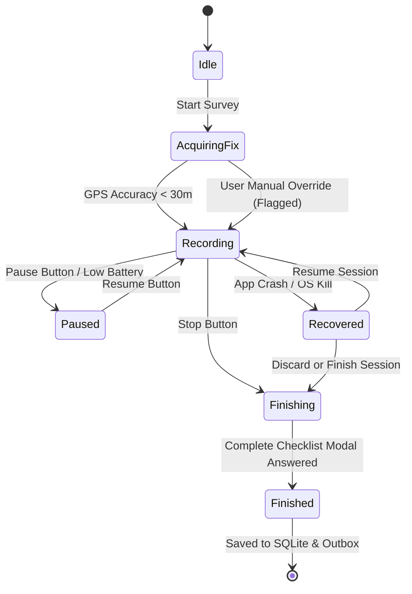

# System Architecture: Hawem Citizen-Science Platform (v2)

## 1. Architectural Philosophy
Hawem collects analysis-ready data on free-roaming cats and dogs in Tunisia to feed into academic and veterinary statistical models (Distance Sampling, Photographic Capture-Recapture, Occupancy, SECR).

1. **Local SQLite is the Source of Truth on Device**: The UI queries SQLite directly via reactive stores and repositories. The device never waits for a network round-trip to commit an observation or track point.
2. **Server is Authoritative for Gamification**: XP ledger, badge verification, streak validation, and leaderboards are validated server-side (anti-cheat Edge Functions) to protect scientific integrity.
3. **Idempotency Everywhere**: All client-generated entities use client-side UUIDv7 timestamps. Sync retries and duplicate pushes are safe no-ops.
4. **Effort & Non-Detections are Primary**: Every observation is bound to a survey session with time, track length, and observer count. Surveys with zero animals seen are recorded and rewarded equally.
5. **Dual-Mode Map & Camera Architecture**:
   - **Custom Development Build (EAS/Native)**: Uses `@rnmapbox/maps` v11+ with offline vector tile packs and `react-native-vision-camera` v4.
   - **Expo Go & Web Fallback**: Seamlessly uses `InteractiveMapView` (Mapbox GL JS v3 via hardware-accelerated WebView) and `expo-camera`, ensuring development and testing are never blocked.

---

## 2. High-Level Architecture Diagram

```
┌───────────────────────────────── Mobile App (Expo SDK 57 / React Native) ───────────────────────────────────┐
│                                                                                                              │
│  UI Layer (Expo Router)                                                                                     │
│  ├── Tabs: (map) · (survey) · (animals) · (progress) · (profile)                                            │
│  ├── Modals: /sighting/[id] · /animal/[id] · /capture                                                        │
│  └── Design System: Apple HIG / Liquid Glass tokens · SF Pro / SF Arabic typography · Dynamic Type          │
│                                                                                                              │
│  Feature & State Layer                                                                                       │
│  ├── Zustand UI Stores: surveyStore, sightingStore, gamificationStore, syncStore                             │
│  ├── TanStack Query: server cache, leaderboard queries, nearby individuals pull                              │
│  └── Domain Validation: Zod schemas shared across client, local DB, and Supabase RPCs                        │
│                                                                                                              │
│  Services & Hardware Abstraction                                                                            │
│  ├── LocationService & TrackRecorder: 5s / 5m adaptive GPS breadcrumbs, speed filtering, battery protection  │
│  ├── HeadingService: Magnetometer compass heading for animal bearing calculation                             │
│  ├── GeoReferencer: @turf/turf destination, point-to-line perpendicular distance, H3 index (res 7 & 9)       │
│  ├── CameraService: Multi-angle ID capture (left flank, right flank, face) + quality checks                 │
│  └── OfflineMapManager: Mapbox tile packs & offline admin boundary geocoding                                 │
│                                                                                                              │
│  Data Layer & Offline Engine                                                                                 │
│  ├── Drizzle ORM + expo-sqlite (Modern synchronous SQLite database)                                          │
│  ├── Outbox Queue: transactional write of record + outbox entry                                              │
│  └── Sync Engine: dependency-ordered push worker (sessions → observations → photos → matches)                │
│                                                                                                              │
└───────────────────────┬───────────────────────────────────────────────────────────────┬──────────────────────┘
                        │ HTTPS (supabase-js, TUS, RPCs)                                │ Mapbox Vector Tiles
┌───────────────────────▼────────────────────────────────────────┐             ┌────────▼───────────────────────┐
│ Supabase Cloud / Self-Hosted Backend                           │             │ Mapbox Platform                │
│ ├── Auth: Email OTP, Phone SMS OTP, Apple, Google              │             │ ├── Streets v12                │
│ ├── Postgres 16 + PostGIS 3.4 (geography EPSG:4326)            │             │ ├── Satellite Streets v12      │
│ ├── Row-Level Security (RLS) with Privacy Zone masking         │             │ ├── Outdoors v12               │
│ ├── Storage: Resumable TUS photo uploads                       │             │ └── Search & Geocoding API     │
│ ├── RPCs: sync_push, sync_pull, nearby_individuals, validate   │             └────────────────────────────────┘
│ └── Scheduled Edge Functions: streaks, leaderboard refreshes   │
└────────────────────────────────────────────────────────────────┘
```

---

## 3. Directory Structure
```
app/
  _layout.tsx                     # Global providers: i18n, SQLite Drizzle, QueryClient, Theme
  (onboarding)/
    index.tsx                     # Welcome, scientific purpose
    language.tsx                  # Language picker (ar-TN default, fr, en)
    permissions.tsx               # Background location, compass, camera
    consent.tsx                   # Research consent v1.0
  (tabs)/
    _layout.tsx                   # 5-Tab Bar (Map, Survey, Animals, Progress, Profile)
    map/index.tsx                 # Mapbox explorer with cluster layers & hex overlay
    survey/index.tsx              # Start survey / active workout telemetry HUD
    animals/index.tsx             # Known individuals catalog & my collection
    progress/index.tsx            # Gamification: XP ring, badges, streaks, leaderboards
    profile/index.tsx             # Surveyor profile, privacy zones, sync status, settings
  sighting/[id].tsx               # Detailed sighting inspector
  animal/[id].tsx                 # Individual profile timeline & resightings
  capture/index.tsx               # Guided photo capture modal
src/
  design-system/                  # HIG Tokens, colors, Liquid Glass materials, components
  features/                       # Feature components & stores
    survey/                       # TrackRecorder HUD, eBird checklist modal
    sighting/                     # Quick sighting, distance slider, bearing compass
    map/                          # MapboxProvider, layer switcher, hex layer
    animals/                      # Individual card, comparison pinch-zoom
    gamification/                 # XP celebration, badge grid, quest cards
    academy/                      # Training modules, BCS 1-5 quiz
    welfare/                      # Priority welfare alert flow
  services/                       # Hardware and platform adapters
    location/                     # expo-location + task manager
    tracking/                     # TrackRecorder state machine
    heading/                      # Device compass
    camera/                       # Multi-angle photo capture
    georef/                       # Turf destination, perpendicular distance, H3
    sync/                         # Outbox worker, TUS photo uploader
  data/
    db/                           # Drizzle schema, migrations, SQLite client
    repositories/                 # SessionRepo, ObservationRepo, AnimalRepo
  domain/                         # Zod schemas, TypeScript types, scoring rules
  i18n/                           # ar.json, fr.json, en.json, RTL setup
```

---

## 4. TrackRecorder State Machine


---

## 5. Security & Privacy Model
1. **Privacy Zones (Observer Protection)**: Users define a safe zone (100–1000m) around their residence. Track points inside privacy zones are stripped from public exports and other users' map views.
2. **Animal Georeferencing**: Animal coordinates are stored using WGS84 and H3 hexes. Animal observation points are visible to research collaborators.
3. **EXIF Sanitization**: Camera service strips personal EXIF (phone serial, device owner) while preserving scientific capture metadata (timestamp, GPS, bearing).
